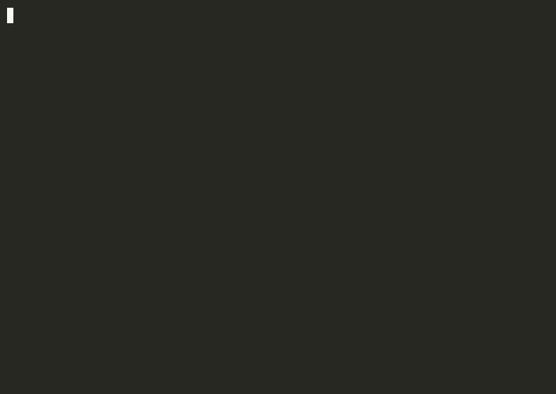

<div align="center">



# 2048-terminal

**An implementation of 2048 for the terminal, in true colour.**

A single Python file with no dependencies and no curses — 24-bit ANSI and the standard library.

<p>
  
  
  
  
</p>

</div>

---

## Requirements

Python 3.6 or later, and a terminal supporting 24-bit colour. Terminal.app, iTerm2, Alacritty, kitty, WezTerm, and current Windows Terminal all qualify.

## Installation

```sh
git clone https://github.com/chakri192/2048-terminal.git
cd 2048-terminal
python3 game2048.py
```

To install on `$PATH`:

```sh
chmod +x game2048.py
ln -s "$PWD/game2048.py" /usr/local/bin/2048
```

## Controls

Enter a letter followed by Return.

| Key | Action |
|---|---|
| `w` | Move up |
| `a` | Move left |
| `s` | Move down |
| `d` | Move right |
| `q` | Quit and report the final score |

Input is line-buffered, so each move requires Return. Arrow keys are not supported; implementing them would require placing the terminal in raw mode and parsing escape sequences, which is the dependency-free simplicity this trades away. `Ctrl-C` exits cleanly and still reports the score.

On reaching 2048 the game offers to continue, allowing play toward a higher tile.

## Implementation

The entire game reduces to three functions applied to a single row:

```python
line = self._compress(self.grid[i])      # [2,0,2,4] → [2,2,4]     remove gaps
line = self._merge(line)                 # [2,2,4]   → [4,4]       combine, score +4
self.grid[i] = self._pad_line(line, 4)   # [4,4]     → [4,4,0,0]   restore width
```

Everything else is bookkeeping around that pipeline. A rightward move is a leftward move on a reversed row, reversed again afterwards. An upward move applies the same pipeline to a column, and a downward move to a reversed column. Four directions, one algorithm, no special cases.

**Merged tiles are locked for the remainder of the move.** `_merge` advances its index by two after combining a pair, so `[2,2,4]` becomes `[4,4]` rather than `[8]`. Without this the game becomes trivial; it is the rule that makes 2048 a puzzle.

**Move legality is determined by simulation.** `_can_move` deep-copies the grid, applies the move, and tests whether anything changed. Because `_merge` modifies `self.score` as a side effect, the probe saves and restores the score — otherwise testing a move would award points for it. Game over is this same check applied in all four directions.

**Tile spawning** places a new tile on a random empty cell: 90% a `2`, 10% a `4`, matching the original.

## Colour scheme

Each tile value uses the palette from the original browser game, emitted as true-colour ANSI (`\033[48;2;R;G;Bm`) rather than the 16-colour approximation most terminal ports adopt.

| Tile | Colour | | Tile | Colour |
|---|---|---|---|---|
| `2` | Light beige | | `128` | Gold |
| `4` | Beige | | `256` | Deeper gold |
| `8` | Orange | | `512` | Golden |
| `16` | Dark orange | | `1024` | Dark golden |
| `32` | Red | | `2048` | Bright gold |
| `64` | Dark red | | above | Dark slate |

Text colour inverts from dark to light at `8`, where the backgrounds become dark enough to require it.

## Project structure

```
2048-terminal/
├── game2048.py    Color · Direction · Game2048 · main    259 lines
└── demo.gif
```

`Game2048` holds the grid, score, move count, and win and game-over flags.

## Contributors

| | |
|---|---|
| [chakri192](https://github.com/chakri192) | Author |
| [aider](https://github.com/Aider-AI/aider) | AI pair programmer |
